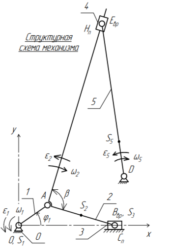
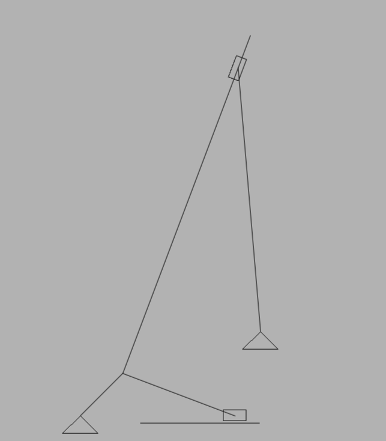

# Механизм 2025 🎯

Крутой проект по созданию 2D-механизма! Работает на SDL3 + Flecs + GLM 

## Что это? 🤔

Интерактивная симуляция механизма с реалистичной физикой. Можно крутить, вертеть и наблюдать как всё двигается!

*Изначальная идея*

  
*Что получилось*

## Фишки ✨

- 🔥 Реалистичное движение деталей
- ⚡ Быстрая графика на SDL3
- 🧠 Умная архитектура на Flecs
- 📐 Точная математика на GLM

## Технологии 💻

- C++ - основной язык
- SDL3 - графика и окно
- Flecs - система компонентов
- GLM - математика для 3D

## Автор 🎓

Сделано с ❤️ студентом-разработчиком

---

*P.S. Механизм правда круто двигается! Обязательно попробуй покрутить его в симуляции* 😉
